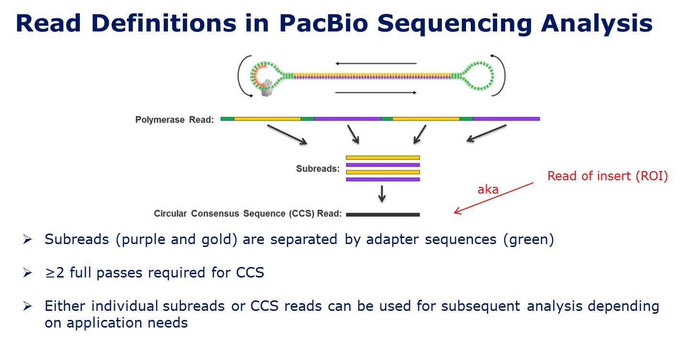
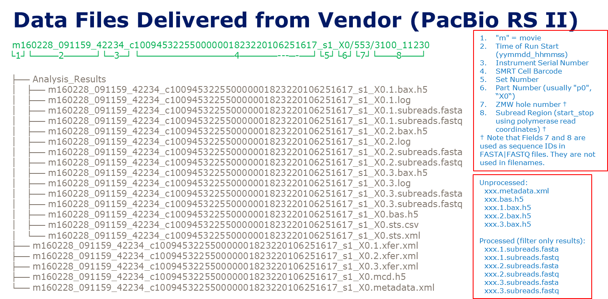

# Genome assembly workflow by using PacBio RS II sequencing

It has been shown 3rd generation sequencing platform PacBio could be used as a golden-standard method for bacterial full genome finishing. Here, I'd like to summarize my experiences on how to obtain a consensus reference genome by using PacBio RS II sequencing reads, with or without illumina sequencing reads.

## Definition

## Files explanation from PacBio RS II

## set up environment
When the sequencing depth is >50x, it's recommended to assembly the full genome using only PacBio sequencing reads. The common selection is HGAP & quiver. However, newly developed canu and classic Celera Assembler followed by pbalign with blastr and quiver could be also used to build the assembly pipeline. We have tested all these 3 tools and compared their results. In my case, it's found that HGAP from PacBio and Canu both could achieve highly consensus reference genome, while using Celera Assembler, the final assemby genome misses some parts. Further examination confirmed that these missing parts are supposed to be existing in our targe genome and both HGAP and Canu capture them in their results. So, we finally select HGAP in SMAR Analysis tools as our pipeline to assemby raw reads. All the corresponding software are installed and used with default parameters, unless we point them out.  

        source /opt/smrtanalysis/current/etc/setup.sh

## creat input.xml
first create a fofn (file of filenames) containing a list of bax.h5 files to be used (it should be full path of bax.h5 files)
        
        is /path/to/.bax.h5 > input.fofn

then generate a input.xml from the input.fofn:

        fofnToSmrtpipeInput.py input.fofn > input.xml

## editing the params.xml

settings_orig.xml is a sample xml file taken from the jobs directory of an HGAP run. Make a copy of this file and put it in the HGAP directory:

        mkdir HGAP
        cd HGAP
        cp ../settings_orig.xml params.xml

Set the genome size to estimated value, eg. 4500000 for ecoli (important so that the correct coverage can be used):

        <param name="genomeSize" label="Genome Size (bp)">
            <title>Approximate genome size in base pairs</title>
            <value>4500000</value>
            <input type="text"/>
            <rule type="digits" required="true" min="1.0" message="Must be a value between 1 and 10000000" max="1.0E7"/>
        </param>

## run HGAP

        smrtpipe.py --params=params.xml xml:input.xml

## circularizing and trimming

Since bacterial genomes are generally circular, confirmed via a dot plot, the beginning and end of the contig contain the same sequence. This results in reads mapping to both locations during the HGAP polishing step, as such the reads have a low mapping score, and are not used to call consensus. In this case a polished assemby will have low quality consensus sequence in these regions. The following workflow from [Circularizing and trimming](https://github.com/PacificBiosciences/Bioinformatics-Training/wiki/Circularizing-and-trimmingaddresses) this problem and will result in a blunt ended circular sequence that has high quality consensus throughout. Other than SMRT Analysis the AMOS package is required. Note part of the AMOS package is included in SMRT Analysis, but a full install is required for this workflow. Note as of 2.3 the AMOS executables in SMRT Analysis work for this procedure, simply source /etc/setup.sh.

1. Open up the polished_assembly.fasta file in a text editor

In the middle of the circular contig introduce a break, i.e. a new line '>Break'. It does not matter where in the sequence you introduce the break, but the sequence immediately after the break will be the start of your circularized sequence.

2. toAmos -s polished_assembly.fasta -o circularized.afg

3. minimus2 circularized

Minimus will overlap and join the ends of the two contigs, the resulting circularized.fasta file should contain one contig for the sequence in which you introduced a break.

4. Any sequence that was not circularized, or extra contigs in which you did not introduce a break will be in circularized.singletons.seq, and can be added back to the circularized.fasta file cat circularized.singletons.seq >> circularized.fasta

However, we found that minimus2 often crashes. For example, it may throw out an unexpected error of "segmentation fault" or circularized.fasta is empty but no any error is reported in the log file. We thus could change an another tool Circlator, with its minimus2 circularization pipeline. Circlator version has a couple of modifications intended to improve the results. This protocol is completely independent of the main Circlator circularization pipeline, and is included for convenience. It is assumed that toAmos and minimus2 are in the user's path, which in reality means that AMOS must be installed.

Run the protocol with:

        circlator minimus2 input_assembly.fasta prefix_of_output_files

To skip the initial merging stage, use

        circlator minimus2 --no_pre_merge input_assembly.fasta prefix_of_output_files
The final output file is called

        prefix_of_output_files.circularise.fasta

and a log file with basic information of what happened is called

        prefix_of_output_files.log

Still, one of my cases is not circularized correctly. By further checking the two ends of the polished assembly sequence from HGAP, we found that the ends of sequence show an inversion to each other. That means, we need to re-assembly the ends of the genome by using long sequencing reads. So, we recommend to use Circlator's standard pipeline:

        circlator all --assembler canu assembly.fasta reads output_directory

Here, Canu is used instead of default SPAdes, which may give better results. Input files assembly.fasta is just the polished assembly sequence from HGAP, and reads are corrected in FASTA or FASTQ format from data/corrected.fastq of HGAP outputs

The pipeline is finished when the file 06.fixstart.ALL_FINISHED is written. The final output FASTA file of the new assembly is called 06.fixstart.fasta. All intermediate files from each stage of the pipeline are also kept in the output directory. 

## Polishing
The sequence now needs to be quiver corrected, to do this simply import the 06.fixstart.fasta file into SMRT Portal as a reference and run a resequencing job with the raw data.

1. create a reference repository
Starting with the FASTA sequence genome.fasta, you upload the sequence to your reference repository using the following command:
        
        referenceUploader -c -p /path/to/repository -n GenomeName -f genome.fasta

where:
•/path/to/repository is the path to your reference repository.
•GenomeName is the name to use for the reference entry that will be created.
•genome.fasta is the FASTA file containing the reference sequence to upload.

2. Then, copy the input.xml to a designated directory and set the reference information in the re-sequencing job params.xml, eg:

    <protocol>
        <param name="reference">
        <!-- Specifiy where is the reference genome. -->
        <value>/home/hp_smrtanalysis/circularizing/HNC47_consensus</value>
        </param>
    </protocol>

3. finally, run HGAP again:
        
        smrtpipe.py --params=params.xml xml:input.xml

## correct indels errors if illumina data exists

PacBio is also well known for its high error rate in indels, although for SNPs it could achieve a very high concensus level due to this kind of error's stochastic characteristics. Therefore, quiver result isn’t perfect. We could further improve it with illumina pair-end sequencing data, including single base differences, small indels, larger indel or block substitution events, gap filling, identification of local misassemblies, etc. In one of my cases, with the help of Pilon, we removed 30 remaining indels in a 4.5 Mbp genome despite Quiver calling > QV 60 consensus. Whether another round of polishing is needed, it's up to the user.

## Genome annotation

If the finally obtained genome is for private use, you may don't want to upload it to the public server for genome anotation, for example, [RAST](https://rast.nmpdr.org/). In such a situation, Prokka could be used:

        prokka \
        --outdir $HOME/genomes/HNC47 --force \
        --prefix HNC47 --addgenes --addmrna --locustag HNC47 \
        --increment 1 --gffver 2 --centre CDC  --compliant \
        --genus Escherichia --species coli --strain HNC47 \
        --kingdom Bacteria  --usegenus \
        --proteins $HOME/genome/BL21_DE3.gb \
        --evalue 1e-9 --rfam \
        $HOME/genomes/HNC47_genome.fasta

The prediction features include coding sequence (CDS), ribosomal RNA genes (rRNA), transfer RNA and tmRNA genes, non-coding RNA, CRISPRs. And it also provides genome annotation results with various formats, e.g., genbank, gff. 

  
 
